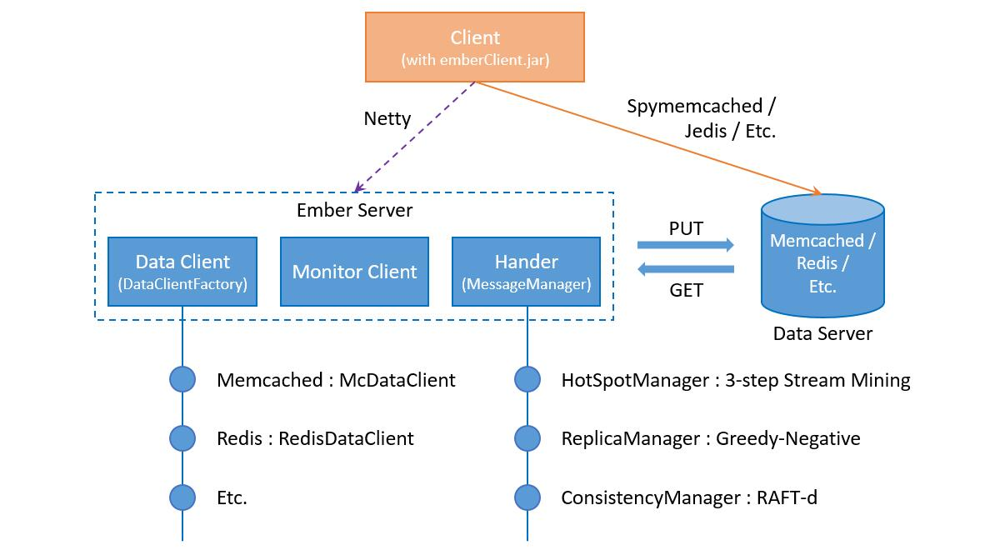

# Ember Server
Ember server is the core of Ember and in responsible for the hot spot detection, replica management and consistency management.

## Update log
- 20161205, reformat codes;
- 20161123, create V3.0 and refactored the code;
- 20160718, create V2.0 and restructure the code and implement the new hot spot detection algorithm;

## Architecture
    
The whole work is an universal middleware for distributed memory stores, which can help balance the load of server cluster by dynamical data replication. 
The image above give a brief structure of Ember server. Ember server consists of three parts: Data Client, Monitor Client and Hander. As an universal middleware, 
Data Client proves a simple interface for user to implement and ember can be deployed on memcached, redis and etc. Monitor Client connects with the monitor server to
get the load of cluster. And Hander is the core of Ember server, which has three modules: HotSpotManager, ReplicaManager and ConsistencyManager.    

**HotSpot Manager.** This module is responsible for the hot spot detection, 
and the hot spot here represents the data items that be visited many times in a short time. 
We adopt a *3-step stream mining* algorithm to find the hot spot, and the three steps are: request sampling, 
data filter and data counter. This method is really effective and the complexity has no relation with the data set.    

**Replica Manager.** The replica manager has two works: create replicas for hot spot and recycle the replicas that no longer used. 
The replica create and replica recycle process are done periodically. 
The replica create and replica recycle process are controlled by the *decider*, which adopts a greedy algorithm to manage the replicas.    

**Consistency Manager.** Unlike the current distributed systems, ember provides a configured consistency, 
which supports the consistency level from eventual consistency to strong consistency, 
and user can choose the consistency level easily by change the corresponding parameters.

## Config
- servers.xml: the servers info
- config.properties: core config parameters

More details about the config are in the wiki.

## Run
Run the *EmberServerMain* class and input the server id.

## 3-party components(core)
- gson 2.3.1
- protobuf-java 2.4.1
- netty 3.5.7.Final

