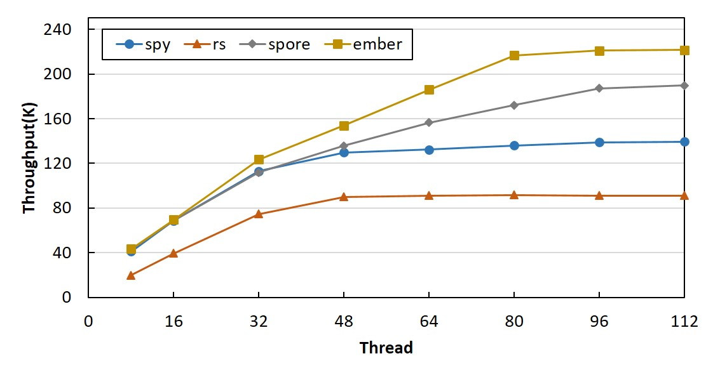
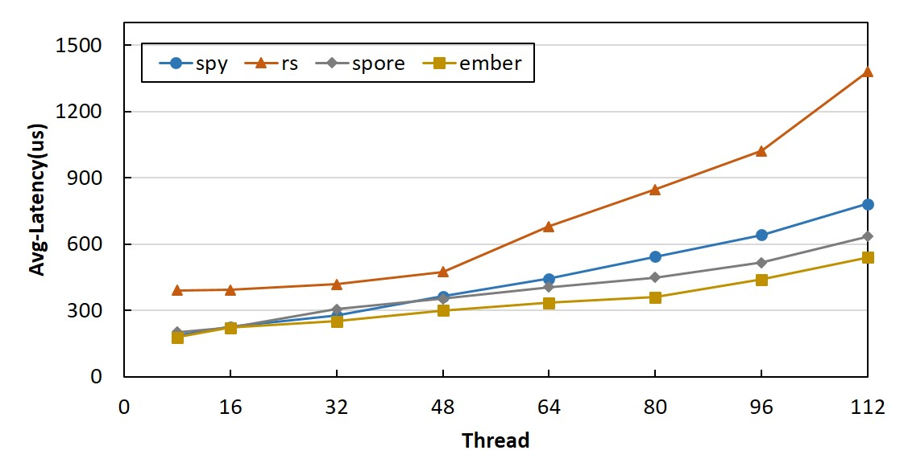
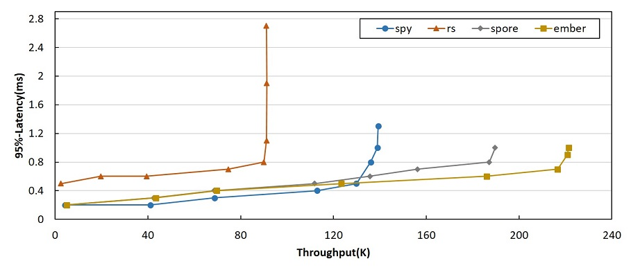

# Ember experiment schedule

## Experiment list
- Spymemcached: the java client of memcached
- Spore: socc 2014
- RS: osdi 2016
- Ember

## Parameters list
### Client parameters
- *client_type*: 0 = MC, 2 = Ember/Spore, 3 = RS
- *replica_mode*: 0 = Ember, 1 = Spore

### Server parameters
- *is_detect_hot_spot*: true | false
- *replica_mode*: 0 = Ember, 1 = Spore, 2 = RS, 3 = Others

### Parameters table

Name|Client Parameters|Server Parameters
----|----|----
Spy|*client_type* = 0|*is_detect_hot_spot* = false
Spore|*client_type* = 2, *replica_mode* = 1|*is_detect_hot_spot* = true, *replica_mode* = 1
RS|*client_type* = 3|*is_detect_hot_spot* = false, *replica_mode* = 2
Ember|*client_type* = 2, *replica_mode* = 0|*is_detect_hot_spot* = true, *replica_mode* = 0

### Inner parameters
#### Ember and Spore
- *update_status_time*: the period to get the workload of whole cluster
- *hot_spot_buffer_size*: size of the hot spot buffer, hot spots will be handled when the buffer is full
- *hot_spot_manager_mode*: the hotSpotManager mode, default mode is StreamHotSpotManager
- *slice_time*: the hotSpotManager period
- *hot_spot_threshold*: the hot spot threshold
- *hot_spot_percentage*: the hot spot percentage in the requests, such as 0.0001
- *hot_spot_influence*: the hot spot influence, such as 0.3
- *bloom_filter_length*: the length of bloom filter
- *bloom_filter_number*: the number of bloom filter
- *frequent_percentage*: the request for the frequent data, as 20/80, this parameter is 0.8

#### YcsbCore
- *server_path*: the path of server list
- *data_hash_mode*: data hash mode
- *data_shards*: data shard number
- *parity_shards*: parity shard number

## Experiment Environment
- PC config: Ubuntu 14.04.3 LTS, 16 cores, 48 GB memory
- java version: 1.7.0_65
- data server: memcached 1.4.6
- workload generator: YCSB
- 2 data server (2 memcached instance each), 1 monitor server, 7 client

## Experiment Result
The workloads are generated by YCSB, where each client can run 16 threads at most, so the most client threads is 7*16.    
    
The throughput and 95%-latency relation. 
    
