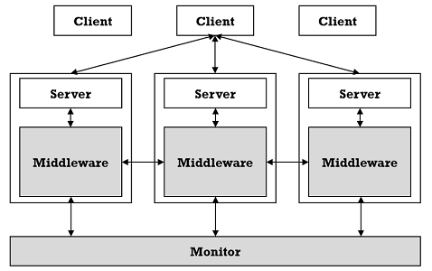
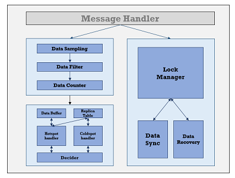

# RMemcached Server
Ember server, which is the core of Ember and in responsible for the hot spot detection, replica management and consistency management.

## 3-party components(core)
- gson 2.3.1
- protobuf-java 2.4.1
- netty 3.5.7.Final
- spymemcached 2.7.3

## Update log
- 20160718, V2.0: restructure the code and implement the new hot spot detection algorithm;

## Architecture
     
The whole work is a universal middleware for distributed memory stores, which can help balance the load of server cluster by data replication. The images above give a brief structure of Ember. The left image is the whole structure of Ember, as described before, what we do is a middleware for distributed memory stores and the middleware do not change the original architecture of memory stores, which makes ember easy to deploy and use. The right image is the core componets of the middleware, which can be divided into three parts: hot spot detector, replica manager and consistency manager. And each part is consists of many sub-modules.    

**Hot spot detector.** This module is responsible for the hot spot detection, and the hot spot here represents the data items that be visted many times in a short time. We adopt a *3-steps data strem* algorithm to find the hot spot, and the three steps are: data sampling, data filter and data counter. This method is really effective and the complexity has no relation with the data set.    

**Replica manager.** The replica manager has two works: create replicas for hot spot and recyle the replicas that no longer used. The replica create and replica recycle process are done periodically. The replica create and replica recycle process are controlled by the *decider*, which adopts a greedy algorithm to manage the replicas.    

**Consistency manager.** Unlike the current distributed systems, ember provides a configured consistency, which supports the consistency level from eventual consistency to strong consistency, and user can choose the consistency level easily by change the corresponding config file.

## Config
- serverlist.xml: the servers info
- config.properties: core config parameters

